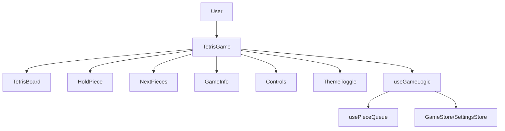
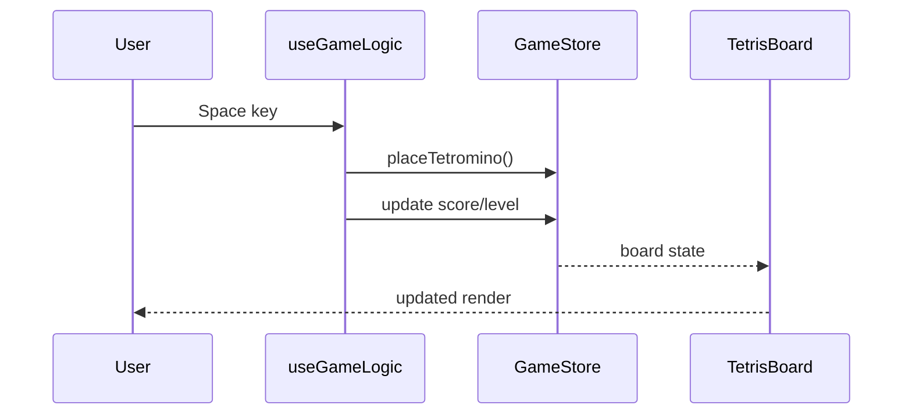

# Design Document

## System Architecture


## Module Structure
```
src/
  app/              # Next.js layout and entry page
  components/
    atoms/          # Basic UI elements (buttons, blocks)
    molecules/      # Composed UI pieces (controls, info panels)
    organisms/      # Higher-level UI such as the game board
    templates/      # Page-level composition (TetrisGame)
  hooks/            # Game logic and piece queue hooks
  store/            # Zustand stores for game state and settings
  utils/            # Game logic helpers and tetromino definitions
  types/            # Shared TypeScript types
  organisms/        # Non-visual logic like SevenBag
```

## Class Diagram
```mermaid
classDiagram
  class Position {
    number x
    number y
  }
  class Tetromino {
    TetrominoType type
    number[][] shape
    Position position
    number rotation
  }
  class GameState {
    (TetrominoType|null)[][] board
    Tetromino? currentPiece
    TetrominoType? holdPiece
    boolean canHold
    number score
    number level
    number lines
    boolean gameOver
    boolean paused
    boolean started
  }
  GameState --> Tetromino
  Tetromino --> Position
```

## Sequence Diagram
Example: player performs a hard drop.


## Database Design
No external database is used. All state is kept in memory via Zustand stores.

## API Specification
The application does not expose HTTP APIs. All interactions occur within the browser through React components and Zustand state.
