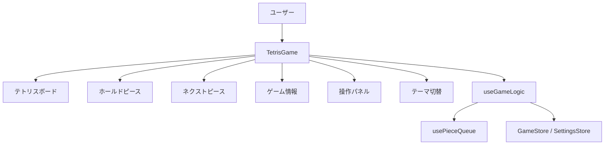
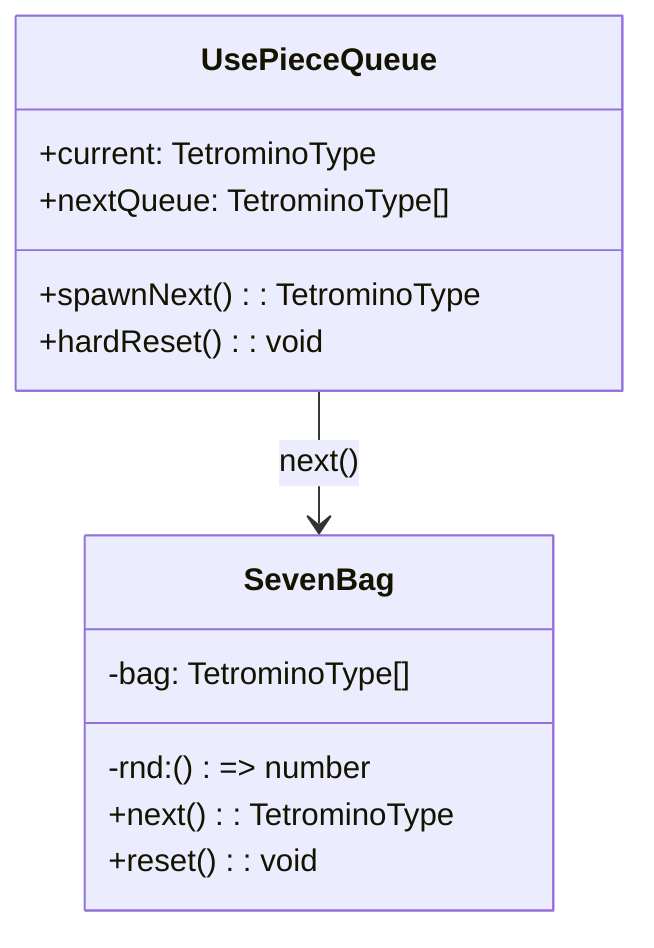
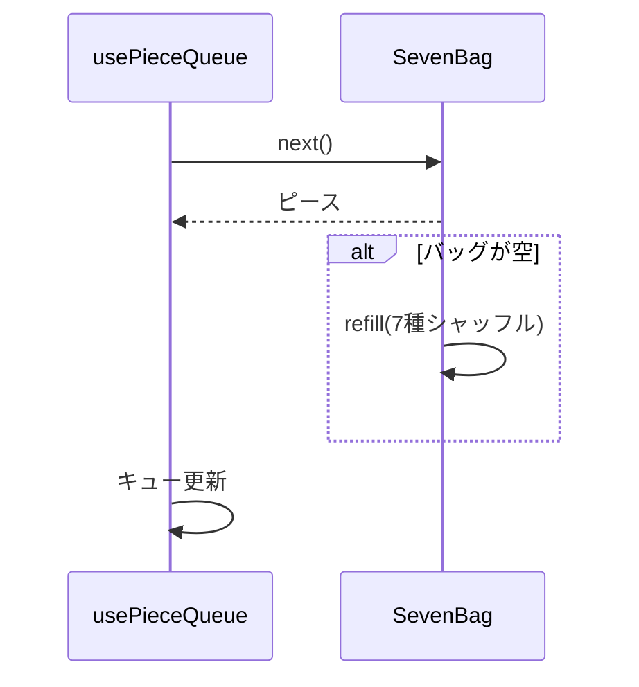
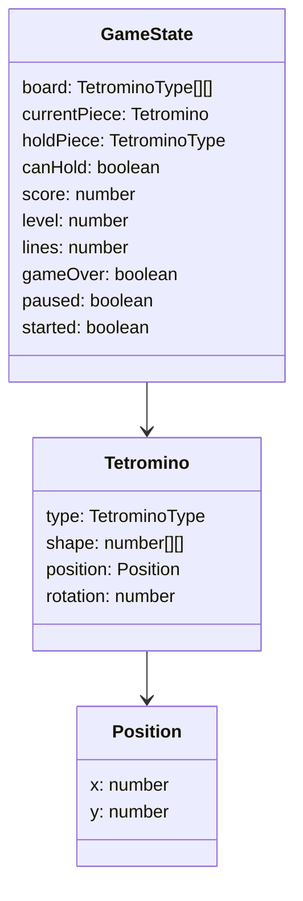
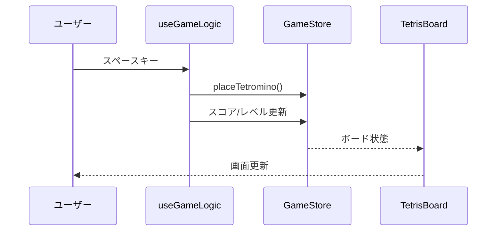

# 設計書

## システム構成


## モジュール構造
```
src/
  app/              # Next.js のレイアウトとエントリページ
  components/
    atoms/          # ボタン・ブロックなどの基本UI要素
    molecules/      # コントロールや情報パネルなどの複合UI
    organisms/      # ゲームボードなどの高レベルUI
    templates/      # ページレベルの構成 (TetrisGame)
  hooks/            # ゲームロジックとピースキュー用のフック
  store/            # ゲーム状態と設定を管理する Zustand ストア
  utils/            # ゲームロジックのヘルパーとテトロミノ定義
  types/            # 共通の TypeScript 型
  lib/              # 汎用的なユーティリティ関数
  organisms/        # SevenBag などの非視覚ロジック
```

## ピース生成（7ミノ1巡方式）
SevenBag クラスはテトロミノ7種類を1巡として袋に詰め、Fisher-Yates シャッフルで順序をランダム化する。袋が空になると自動的に再補充され、すべての種類が公平に出現する。

`usePieceQueue` フックは SevenBag を利用し、プレビュー数ぶんのキューを常に維持する。`spawnNext` でキュー先頭を消費し、新しいピースを補充する。`hardReset` は SevenBag をリセットして新しい巡を開始する。

### クラス図


### シーケンス図


## クラス図


## シーケンス図
例: プレイヤーがハードドロップを実行する。


## データベース設計
外部データベースは使用せず、状態はすべて Zustand ストアでメモリ管理する。

## API仕様
HTTP API は提供せず、すべての操作はブラウザ内の React コンポーネントと Zustand 状態を通じて行われる。
