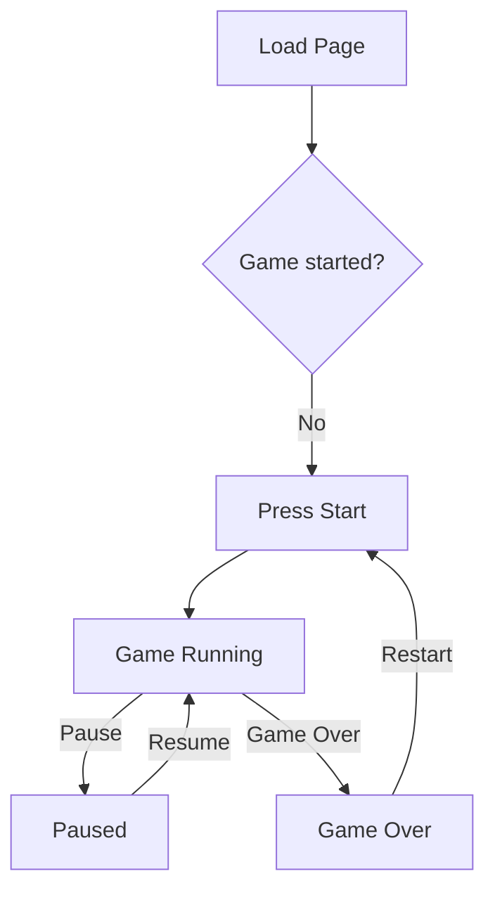

# Specification

## System Overview
This project implements a browser-based Tetris game using Next.js and React. The interface combines a playfield, hold/next piece panels, score display, and a theme toggle to deliver a modern Tetris experience.

## Target Users & Purpose
- **Casual players** looking to play Tetris in the browser.
- **Developers** exploring stateful game logic within a React/Next.js application.

## Functional Features
| ID | Name | Overview |
|----|------|----------|
| F1 | Start/Pause/Resume | Start the game and control pause or resume state from the main screen. |
| F2 | Piece Movement & Rotation | Move pieces left/right, soft drop, hard drop, and rotate in both directions using keyboard inputs. |
| F3 | Hold & Next Piece | Hold the current piece and preview upcoming pieces using a seven-bag queue. |
| F4 | Ghost Piece Toggle | Show or hide a translucent "ghost" piece to preview landing position. |
| F5 | Scoring & Levels | Track score, level, and cleared lines with game-over and pause messages. |
| F6 | Theme Switching | Switch between light and dark themes during gameplay. |

## Non-functional Requirements
- **Performance**: Game loop is driven by `requestAnimationFrame` for smooth rendering.
- **Responsiveness**: Layout adapts across screen sizes using Tailwind CSS utilities.
- **Maintainability**: Modular React components and Zustand stores keep logic and presentation separated.
- **Portability**: Runs entirely in the browser with no server-side dependencies.

## User Flow

