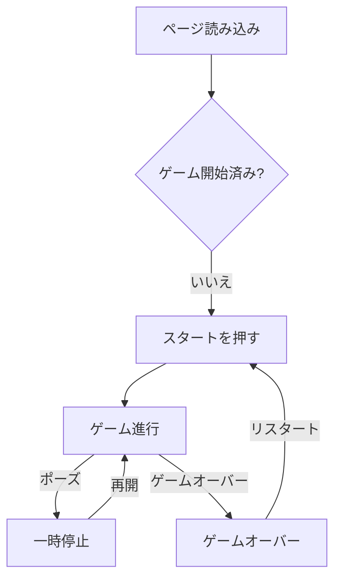

# 仕様書

## システム概要
本プロジェクトは Next.js と React を用いたブラウザ版テトリスゲームです。プレイフィールド、ホールド/ネクストピースのパネル、スコア表示、テーマ切替を備え、現代的なテトリス体験を提供します。

## 対象ユーザー・利用目的
- **カジュアルプレイヤー**: ブラウザ上で手軽にテトリスを楽しみたい利用者
- **開発者**: React/Next.js アプリケーションにおける状態管理やゲームロジックを学びたい人

## 機能一覧
| ID | 名称 | 概要 |
|----|------|------|
| F1 | スタート/ポーズ/再開 | メイン画面からゲーム開始、ポーズ、再開を制御する |
| F2 | ピースの移動・回転 | キーボード入力で左右移動、ソフトドロップ、ハードドロップ、左右回転を行う |
| F3 | ホールド＆ネクストピース | 現在のピースを保持し、七袋方式のキューで次のピースを表示する |
| F4 | ゴーストピース切替 | 着地位置の透明な「ゴースト」ピースの表示/非表示を切り替える |
| F5 | スコア＆レベル | スコア、レベル、消去ライン数を追跡し、ゲームオーバーやポーズメッセージを表示する |
| F6 | テーマ切替 | プレイ中にライト/ダークテーマを切り替える |

## 非機能要件
- **性能**: `requestAnimationFrame` を用いて滑らかな描画を実現
- **レスポンシブ**: Tailwind CSS により様々な画面サイズでレイアウトが適応
- **保守性**: React コンポーネントと Zustand ストアによりロジックと表示を分離
- **ポータビリティ**: ブラウザのみで動作し、サーバーサイド依存を持たない
- **セキュリティ**: 外部通信を行わずユーザーデータを保持しない
- **可用性**: ネットワーク障害の影響を受けにくく、ブラウザさえあれば利用可能

## 想定利用フロー

